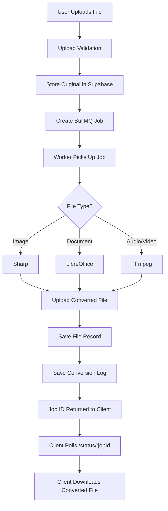

<div align="center">


<br/>

**A production-ready, async file conversion platform.**  
Upload. Convert. Download. At scale.

<br/>

[](https://nodejs.org)
[](https://expressjs.com)
[](https://postgresql.org)
[](https://redis.io)
[](https://supabase.com)
[](https://docker.com)
[](https://docs.bullmq.io)

</div>

---

## What is SmokeByte?

SmokeByte is a backend platform that lets users securely upload files, convert them to different formats through an asynchronous background queue, track conversion status in real-time, and download the results from cloud storage — all via a clean REST API.

It's built to handle image, document, audio, and video conversions reliably, even under load.

---

## Features

### 🔐 Authentication & Security

| Feature | Details |
|---|---|
| JWT Auth | Access + Refresh token architecture |
| Password Hashing | bcrypt |
| Route Protection | Middleware-guarded endpoints |
| User Isolation | Each user sees only their own resources |
| Hardening | Helmet, CORS, Rate Limiting |

### 🔄 File Conversion

#### 🖼️ Images — via Sharp

| From | To |
|---|---|
| JPG | PNG, WEBP |
| PNG | JPG, WEBP |
| WEBP | JPG, PNG |

#### 📄 Documents — via LibreOffice

| From | To |
|---|---|
| PDF | DOCX, TXT |
| DOCX | PDF, TXT |
| TXT | PDF, DOCX |
| PPT / PPTX | PDF |

#### 🎵 Audio & Video — via FFmpeg

Supports cross-format conversion across: `MP4`, `AVI`, `MOV`, `WEBM`, `MP3`, `WAV`, `AAC`, `FLAC`, `OGG`, `M4A`, `WMA`

### ⚙️ Queue-Based Processing

- **BullMQ** powered job queue backed by Redis
- Background worker processes jobs asynchronously
- Each conversion tracked by a BullMQ Job ID
- Workers are decoupled from the API — scale independently

### ☁️ Storage

- Converted files stored in **Supabase Object Storage**
- Temporary local files auto-cleaned post-upload
- Secure, user-scoped download URLs

### 📦 User Features

- Conversion history per user
- Real-time job status polling
- Secure file download
- Full resource isolation between users

---

## Architecture

```
Frontend / API Client
        │
        ▼
  Express REST API
  ┌─────┴──────────────────────┐
  │  Auth  │  Upload  │  Jobs  │
  └─────┬──────────────────────┘
        │
        ▼
    BullMQ Queue  ←──  Redis
        │
        ▼
     Worker Process
     ┌────┬────┬────┐
     │    │    │    │
     ▼    ▼    ▼    ▼
  Sharp FFmpeg LibreOffice
     │    │    │
     └────┴────┘
           │
           ▼
   Supabase Object Storage
           │
           ▼
       PostgreSQL
```

---

## Workflow


```mermaid
flowchart TD
    A[User Uploads File] --> B[Upload Validation]
    B --> C[Store Original in Supabase]
    C --> D[Create BullMQ Job]
    D --> E[Worker Picks Up Job]
    E --> F{File Type?}

    F -->|Image| G[Sharp]
    F -->|Document| H[LibreOffice]
    F -->|Audio/Video| I[FFmpeg]

    G --> J[Upload Converted File]
    H --> J
    I --> J

    J --> K[Save File Record]
    K --> L[Save Conversion Log]
    L --> M[Job ID Returned to Client]
    M --> N[Client Polls /status/:jobId]
    N --> O[Client Downloads Converted File]
```

---

## Project Structure

```
src/
├── config/
│   ├── db.js                 # PostgreSQL connection
│   └── supabase.js           # Supabase client
│
├── controllers/
│   ├── authController.js
│   ├── conversionController.js
│   ├── statusController.js
│   ├── historyController.js
│   └── userController.js
│
├── jobs/
│   ├── queue.js              # BullMQ queue definition
│   └── worker.js             # Background job processor
│
├── middlewares/
│   ├── authMiddleware.js     # JWT verification
│   ├── uploadMiddleware.js   # Multer file handling
│   ├── rateLimiter.js
│   └── errorHandler.js
│
├── models/
│   ├── userModel.js
│   ├── fileModel.js
│   ├── conversionLogs.js
│   └── refreshTokenModel.js
│
├── routes/
│   ├── authRoutes.js
│   ├── conversionRoutes.js
│   ├── statusRoutes.js
│   ├── historyRoutes.js
│   └── userRoutes.js
│
├── services/
│   ├── imageService.js       # Sharp logic
│   ├── documentService.js    # LibreOffice logic
│   ├── audiovideoService.js  # FFmpeg logic
│   └── storageService.js     # Supabase upload/download
│
├── utils/
│   ├── jwtUtils.js
│   ├── fileUtils.js
│   └── logger.js
│
├── app.js
└── server.js
```

---

## API Reference

### Auth

```http
POST   /auth/register          # Create new account
POST   /auth/login             # Login, receive access + refresh tokens
POST   /auth/refresh-token     # Get new access token using refresh token
POST   /auth/logout            # Invalidate session
```

### User

```http
GET    /user/me                # Get authenticated user profile
GET    /user/history           # Get user's conversion history
```

### Conversion

```http
POST   /convert/image          # Convert image files
POST   /convert/document       # Convert document files
POST   /convert/media          # Convert audio/video files
```

> All `/convert/*` endpoints return a `jobId` for polling.

### Status & Download

```http
GET    /status/:jobId          # Poll conversion job status
GET    /download               # Download converted file
```

---

## Getting Started

### 1. Clone & Install

```bash
git clone <repository-url>
cd SmokeByte
npm install
```

### 2. Configure Environment

Create a `.env` file at the project root:

```env
PORT=3000

DATABASE_URL=

JWT_SECRET=
JWT_REFRESH_SECRET=

REDIS_URL=

SUPABASE_URL=
SUPABASE_KEY=
SUPABASE_SERVICE_ROLE_KEY=
SUPABASE_BUCKET=convert-files

NODE_ENV=production
```

### 3. Run Development Server

```bash
# Start API server
npm run dev

# Start worker (separate terminal)
node src/jobs/worker.js
```

> The API server and the worker are separate processes. Both need to be running for end-to-end conversions to work.

---

## Docker

```bash
# Build image
docker build -t smokebyte .

# Run container
docker run -p 3000:3000 smokebyte
```

---

## Tech Stack

| Layer | Technology |
|---|---|
| Runtime | Node.js |
| Framework | Express.js |
| Database | PostgreSQL + Sequelize ORM |
| Auth | JWT, Refresh Tokens, bcrypt |
| Queue | BullMQ + Redis (Upstash) |
| Storage | Supabase Object Storage |
| Image Processing | Sharp |
| Media Processing | FFmpeg |
| Document Processing | LibreOffice |
| Infrastructure | Docker, PM2, Cloudflare Tunnel |

---

## Roadmap

- [ ] Email verification on signup
- [ ] Password reset via email
- [ ] Refresh token rotation
- [ ] Admin dashboard
- [ ] Conversion analytics
- [ ] WebSocket-based real-time status updates
- [ ] Multi-file batch conversion

---

## Author

**Pushpak Pathe**

Backend Developer — Node.js · Express.js · PostgreSQL · Redis · Docker

---

<div align="center">

Built with ☕ and way too many conversion edge cases.

</div>
